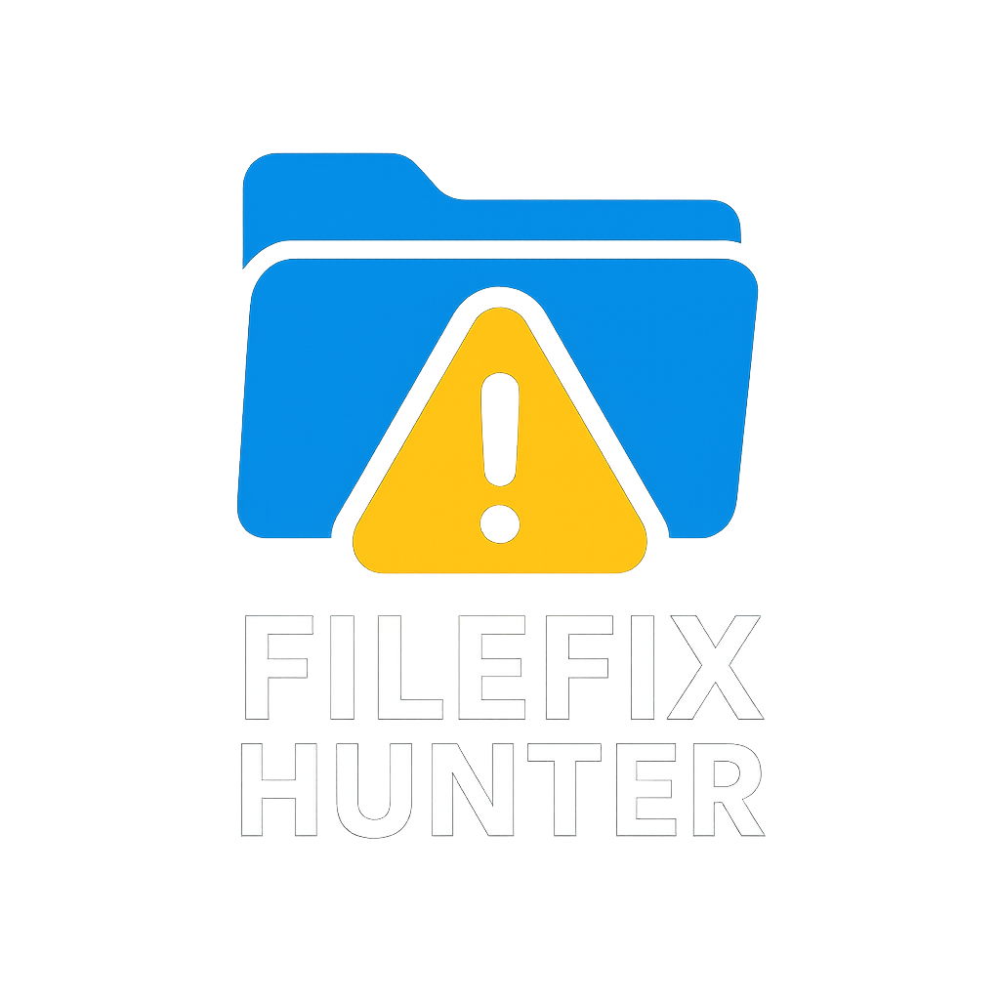
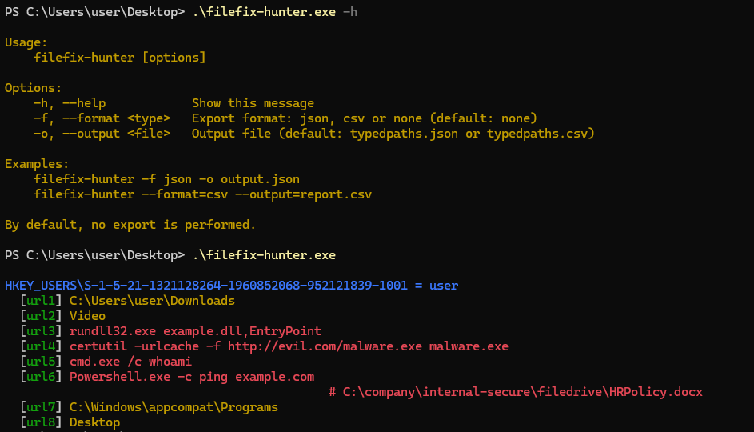

# Filefix Hunter


<p align="center">
  
</p>

**filefix-hunter** is a forensic tool written in Rust for incident response. It enumerates TypedPaths entries in Windows registry to detect possible LOLBIN or filefix.exe exploitation traces.

<p align="center">
    <a href="https://ko-fi.com/durok" target="_blank">
        
    </a>
</p>

---

## 🚀 Purpose

- Scan all `HKEY_USERS\<SID>\Software\Microsoft\Windows\CurrentVersion\Explorer\TypedPaths` for each user.
- Look for suspicious commands, LOLBINs, known IOCs (Mimikatz, shellcode).
- Highlight suspicious entries (**red**) vs safe entries (**yellow**).
- Optionally export results to **JSON** or **CSV**.

---

## ⚠️ filefix Vulnerability

The **filefix** vulnerability exploits careless user behavior by getting them to paste malicious commands into Explorer’s address bar, leading to code execution with LOLBINs. More info [here](https://mrd0x.com/filefix-clickfix-alternative/).

---

## 🔧 Setup Environment for Windows cross-compilation

If building on Linux to produce a Windows binary:

```bash
sudo apt update
sudo apt install -y build-essential pkg-config libssl-dev rustup gcc-mingw-w64

rustup default stable
rustup target add x86_64-pc-windows-gnu
source $HOME/.cargo/env
```

## 🛠️ Build

Clone the repository and build the Windows binary:

```bash
git clone https://github.com/FreeDurok/Filefix-Hunter.git
cd filefix-hunter
cargo build --release --target x86_64-pc-windows-gnu
```
---

## 🚀 Usage

```sh
filefix-hunter [options]
```

Options:

* `-h, --help` : show help
* `-f, --format <json|csv|none>` : export format
* `-o, --output <file>` : output file name

Examples:

```sh
filefix-hunter -f json -o report.json
filefix-hunter --format=csv --output=report.csv
```
---


## 📝 Output

### Example Output

Records highlighted in **red** are those that match suspicious entries detected by the tool.

<p align="left">
    
</p>


JSON/CSV includes:

* `sid`, `username`, `name`, `value`
* `suspicious: true/false`
* `matched` reason

---

## 📝 License

MIT License

---
